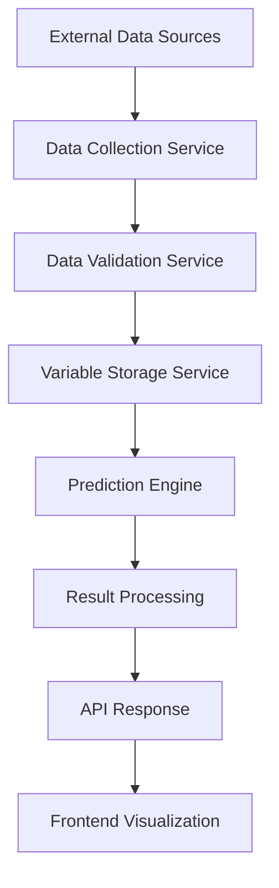

# Architecture Guide

## System Overview

The BRETT Earthquake Prediction System v4.0 implements a sophisticated 12-Dimensional GAL-CRM (Geological and Electromagnetic Correlation and Resonance Modeling) Framework for real-time earthquake risk assessment.

## Core Architecture

### 12-Dimensional GAL-CRM Framework

The system operates on a multi-dimensional analysis framework combining terrestrial and cosmic electromagnetic measurements:

#### Earth Variables (24 Dimensions)
1. **Electromagnetic Field Strength** - Local EMF intensity measurements
2. **Magnetic Declination** - Regional magnetic field variations
3. **Conductivity Mapping** - Subsurface electrical conductivity
4. **Seismic Velocity** - P-wave and S-wave propagation speeds
5. **Gravitational Anomalies** - Local gravitational field variations
6. **Thermal Gradients** - Subsurface temperature variations
7. **Stress Accumulation** - Tectonic stress measurements
8. **Fault Line Proximity** - Distance to known fault systems
9. **Rock Density** - Geological density variations
10. **Porosity Index** - Rock porosity and permeability
11. **Fluid Pressure** - Pore pressure in rock formations
12. **Crustal Thickness** - Local crustal depth measurements
13. **Elevation Gradient** - Topographical variations
14. **Soil Composition** - Surface geological composition
15. **Mineral Content** - Metallic mineral concentrations
16. **Water Table Depth** - Groundwater level variations
17. **Radon Emissions** - Radioactive gas concentrations
18. **Micro-seismic Activity** - Background seismic noise
19. **Strain Rate** - Crustal deformation measurements
20. **Magnetic Susceptibility** - Rock magnetic properties
21. **Electrical Resistivity** - Subsurface resistance measurements
22. **Acoustic Velocity** - Sound propagation characteristics
23. **Density Contrast** - Geological boundary definitions
24. **Harmonic Resonance** - Natural frequency responses

#### Space Variables (12 Dimensions)
1. **Solar Wind Speed** - Charged particle velocity from sun
2. **Magnetic Field Intensity** - Interplanetary magnetic field strength
3. **Cosmic Ray Flux** - High-energy particle bombardment
4. **Geomagnetic Index** - Global magnetic field disturbances
5. **Solar Flux Density** - Radio wave emissions from sun
6. **Planetary Alignment** - Gravitational influence coefficients
7. **Ionospheric Density** - Upper atmosphere electron concentration
8. **Magnetospheric Pressure** - Solar wind interaction pressure
9. **Auroral Activity** - Polar electromagnetic phenomena
10. **Schumann Resonance** - Global electromagnetic resonance
11. **Solar Cycle Phase** - 11-year solar activity cycle position
12. **Coronal Mass Ejection** - Solar plasma eruption effects

### Harmonic Amplification Theory

#### CMYK Tetrahedral Analysis
The system employs a tetrahedral geometric model for electromagnetic field analysis:

- **Base Angle**: 54.74° for CMYK lens mechanics calculations
- **Tetrahedral Geometry**: Four-point electromagnetic field mapping
- **Resonance Calculation**: Harmonic frequency amplification
- **Phase Correlation**: Electromagnetic wave synchronization

#### Planetary Incidence Calculations
Space-based electromagnetic analysis uses:

- **Incidence Angle**: 26.565° for sun ray refraction calculations
- **Atmospheric Refraction**: Solar electromagnetic penetration
- **Ionospheric Interaction**: Upper atmosphere electromagnetic effects
- **Magnetospheric Coupling**: Solar wind interaction modeling

#### Regional Modifiers
Harmonic amplification varies by geographical region:

- **Europe**: 1.0 (baseline)
- **Africa**: 1.1 (enhanced geological activity)
- **Asia**: 0.9 (stable continental mass)
- **Americas**: 1.2 (active tectonic zones)
- **Middle East**: 1.05 (moderate geological activity)
- **Oceania**: 0.95 (oceanic plate stability)
- **Arctic**: 0.8 (reduced electromagnetic activity)

## Prediction Engines

### BRETTEARTH Engine

**Purpose**: Terrestrial-focused earthquake prediction using earth-based electromagnetic analysis.

**Architecture**:
```python
class BrettEarthEngine:
    def __init__(self):
        self.earth_variables = 24
        self.analysis_depth = "crustal"
        self.regional_modifiers = True
        
    def calculate_prediction(self, location, radius):
        # 1. Collect 24 earth variables
        earth_data = self.collect_earth_variables(location, radius)
        
        # 2. Apply regional modifiers
        modified_data = self.apply_regional_modifiers(earth_data, location)
        
        # 3. Calculate CMYK tetrahedral analysis
        cmyk_result = self.calculate_cmyk_model(modified_data)
        
        # 4. Generate 21-day predictions
        predictions = self.generate_predictions(cmyk_result)
        
        return predictions
```

**Key Features**:
- 24-variable earth electromagnetic analysis
- Regional geological factor integration
- CMYK tetrahedral calculations at 54.74° base angle
- Optimized for local and regional predictions

### BRETTCOMBO Engine

**Purpose**: Combined space + earth analysis for comprehensive global earthquake prediction.

**Architecture**:
```python
class BrettComboEngine:
    def __init__(self):
        self.earth_variables = 24
        self.space_variables = 12
        self.total_variables = 36
        self.cosmic_correlation = True
        
    def calculate_prediction(self, location, radius):
        # 1. Collect earth and space variables
        earth_data = self.collect_earth_variables(location, radius)
        space_data = self.collect_space_variables()
        
        # 2. Calculate planetary incidence
        incidence_factor = self.calculate_planetary_incidence(26.565)
        
        # 3. Correlate space and earth data
        correlated_data = self.correlate_space_earth(earth_data, space_data)
        
        # 4. Apply harmonic amplification
        amplified_data = self.apply_harmonic_amplification(correlated_data)
        
        # 5. Generate enhanced predictions
        predictions = self.generate_enhanced_predictions(amplified_data)
        
        return predictions
```

**Key Features**:
- 36-variable comprehensive modeling (24 earth + 12 space)
- Planetary incidence calculations at 26.565°
- Space-earth electromagnetic correlation
- Enhanced accuracy through cosmic correlation

## Data Flow Architecture

### Real-Time Data Pipeline



#### Data Sources Integration

**USGS (United States Geological Survey)**
- Real-time earthquake data
- Seismic monitoring networks
- Geological survey information

**EMSC (European-Mediterranean Seismological Centre)**
- Regional earthquake monitoring
- European seismic networks
- Mediterranean geological data

**NASA Space Weather**
- Solar activity monitoring
- Cosmic ray measurements
- Magnetospheric data

**NOAA Space Weather Prediction Center**
- Geomagnetic indices
- Solar wind measurements
- Ionospheric monitoring

**GFZ Potsdam**
- Global geophysical data
- Magnetic field measurements
- Gravitational monitoring

### Backend Architecture

#### FastAPI Application Structure

```
backend/app/
├── api/                    # REST API endpoints
│   ├── prediction.py      # Prediction engine endpoints
│   ├── location.py        # Location validation
│   └── data.py           # Data source management
├── core/                  # Core prediction engines
│   ├── brett_engine.py   # BRETTEARTH engine
│   ├── space_correlation_engine.py  # BRETTCOMBO engine
│   └── brett_engine_v39.py  # Latest engine version
├── services/              # External service integrations
│   ├── data_sources.py   # Data source management
│   ├── variable_storage_service.py  # Variable storage
│   └── historical_data_sources.py   # Historical data
├── models/               # Pydantic data models
│   └── prediction.py    # Prediction response models
└── main_earthquake.py   # Application entry point
```

#### Asynchronous Processing

The backend uses asynchronous processing for optimal performance:

```python
async def fetch_all_data_sources():
    tasks = [
        fetch_usgs_data(),
        fetch_emsc_data(),
        fetch_nasa_data(),
        fetch_noaa_data(),
        fetch_gfz_data()
    ]
    results = await asyncio.gather(*tasks, return_exceptions=True)
    return process_results(results)
```

### Frontend Architecture

#### React Component Structure

```
frontend/src/
├── components/           # React components
│   ├── LandingPage.tsx          # System overview
│   ├── LocationInputPage.tsx    # Location selection
│   ├── EngineSelectionPage.tsx  # Engine choice
│   ├── PredictionDisplayPage.tsx # Results display
│   └── CymaticVisualizationPage.tsx # 3D visualization
├── contexts/            # State management
│   ├── AuthContext.tsx  # Authentication state
│   └── DataContext.tsx  # Application data state
├── types/              # TypeScript definitions
│   └── prediction.ts   # Prediction data types
└── App.tsx            # Main application component
```

#### State Management

The frontend uses React Context for state management:

```typescript
interface DataContextType {
  location: LocationData | null;
  predictions: PredictionResult | null;
  selectedEngine: 'brettearth' | 'brettcombo';
  loading: boolean;
  error: string | null;
}
```

#### 3D Visualization

Three.js integration for cymatic wave visualization:

```typescript
class CymaticRenderer {
  private scene: THREE.Scene;
  private camera: THREE.PerspectiveCamera;
  private renderer: THREE.WebGLRenderer;
  
  renderWaveField(data: CymaticData) {
    // Create electromagnetic wave field visualization
    const geometry = new THREE.PlaneGeometry(100, 100, 256, 256);
    const material = new THREE.ShaderMaterial({
      uniforms: {
        time: { value: 0 },
        amplitude: { value: data.amplitude },
        frequency: { value: data.frequency }
      },
      vertexShader: waveVertexShader,
      fragmentShader: waveFragmentShader
    });
    
    const mesh = new THREE.Mesh(geometry, material);
    this.scene.add(mesh);
  }
}
```

## Security Architecture

### API Security

**Authentication**
- JWT token-based authentication
- API key validation for external services
- Rate limiting for API endpoints

**Data Validation**
- Pydantic models for request validation
- Input sanitization and validation
- SQL injection prevention

**HTTPS Enforcement**
- TLS encryption for all communications
- Secure cookie handling
- CORS configuration

### Data Privacy

**Location Data**
- Coordinates processed in memory only
- No persistent storage of user locations
- Anonymized logging for debugging

**API Keys**
- Environment variable storage
- No hardcoded credentials
- Secure key rotation procedures

## Performance Optimization

### Backend Optimization

**Caching Strategy**
```python
@lru_cache(maxsize=128)
def calculate_regional_modifier(latitude: float, longitude: float) -> float:
    # Cache regional calculations for performance
    return get_regional_modifier(latitude, longitude)
```

**Database Optimization**
- Connection pooling for database access
- Indexed queries for fast data retrieval
- Async database operations

**Memory Management**
- Efficient data structures for large datasets
- Garbage collection optimization
- Memory profiling and monitoring

### Frontend Optimization

**Code Splitting**
```typescript
const CymaticVisualizationPage = lazy(() => import('./CymaticVisualizationPage'));
```

**Asset Optimization**
- Vite build optimization
- Tree shaking for unused code
- Compressed asset delivery

**3D Rendering Optimization**
- WebGL performance optimization
- Efficient geometry and texture handling
- Frame rate monitoring and adjustment

## Scalability Considerations

### Horizontal Scaling

**Load Balancing**
- Multiple backend instances
- Database read replicas
- CDN for static assets

**Microservices Architecture**
- Separate services for different data sources
- Independent scaling of prediction engines
- Service mesh for communication

### Monitoring and Observability

**Logging**
- Structured logging with correlation IDs
- Centralized log aggregation
- Error tracking and alerting

**Metrics**
- Application performance monitoring
- Resource utilization tracking
- User experience metrics

**Health Checks**
- Endpoint health monitoring
- Data source availability checks
- Automated failover procedures

## Future Architecture Enhancements

### Machine Learning Integration

**Planned Enhancements**
- TensorFlow/PyTorch model integration
- Historical data pattern recognition
- Adaptive prediction algorithm refinement

**Model Architecture**
```python
class MLEnhancedPredictor:
    def __init__(self):
        self.traditional_engine = BrettComboEngine()
        self.ml_model = load_trained_model()
        
    def predict(self, data):
        traditional_result = self.traditional_engine.calculate_prediction(data)
        ml_enhancement = self.ml_model.predict(data)
        return combine_predictions(traditional_result, ml_enhancement)
```

### Real-Time Streaming

**Event-Driven Architecture**
- WebSocket connections for real-time updates
- Event streaming for data source changes
- Real-time visualization updates

### Cloud-Native Deployment

**Containerization**
- Docker containers for all services
- Kubernetes orchestration
- Auto-scaling based on demand

**Cloud Services**
- Managed database services
- Serverless function integration
- Global content delivery networks

This architecture provides a robust, scalable foundation for the BRETT Earthquake Prediction System while maintaining the scientific accuracy and real-time capabilities required for effective earthquake risk assessment.
